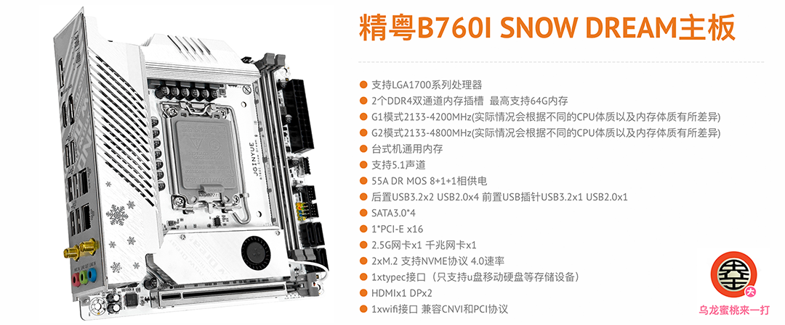

## 精粤 B760I SNOW DREAM 黑苹果 OpenCore EFI



### [ENGLISH](https://github.com/hackintosh-club/JINGYUE-B760I-SNOW-DREAM-OpenCore)

### OpenCore

[OpenCore 0.9.9](https://github.com/acidanthera/OpenCorePkg)

### macOS

- macOS Monterey 12.x
- macOS Ventura  13.x
- macOS Sonoma   14.x

### 硬件

- 芯片组: B760
- Bios 版本: JYI76009 06/06/2023
- 处理器: 英特尔13代 i5-13400
- 内存: 金百达 银爵 32GB DDR4 3600Mhz
- 硬盘: 梵想 Fanxiang S790 1TB Windows
- 硬盘: 西数 SN 770 1TB MacOS
- 核显: 英特尔超核心显卡730 (仅在Windows中可以使用)
- 独显: 蓝宝石 Radeon RX 570 8GB GDDR5
- 声卡: 瑞昱 ALC897
- 有线网卡:  瑞昱 RTL8125 Gaming 2.5GbE
- 有线网卡: 瑞昱 RTL8168H/8111H
- 无线网卡: 英特尔 AX211
- 处理器散热：利民 AXP90-AX47
- 机箱:  超频三 蜂鸟 i100pro
- 电源:  全汉经典版 MS 500W 80 铜牌全模组

### BIOS设置

```
高级
     |-- CPU电源管理控制
        |-- CPU锁配置
	         |-- CFG锁定：关闭
	   |-- PCI总线驱动版本     
	       |-- Re-Size BAR Support：Disabled
     |-- CSM配置
	      |-- CSM支持：关闭
		
启动
  |-- 安全启动
    |-- 安全启动：关闭
```

### 注意事项

 - 安装成功后必须使用 [OpenCore Configurator](https://mackie100projects.altervista.org/opencore-configurator/) 或者 [OCAuxiliaryTools](https://github.com/ic005k/OCAuxiliaryTools) 生成你自己的 SMBIOS
 - 如需使用没有小核心的CPU，必须取消勾选配置文件中Kernel--ProvideCurrentCpuinfo选项
 - 此EFI中的英特尔无线网卡驱动[AirportItlwm.kext](https://github.com/OpenIntelWireless/itlwm/releases)仅适用于 MacOS 14 Sonoma,安装其它版本请自行下载替换此驱动
 - 英特尔无线网卡无法使用隔空投送等功能

### 参考内容

[1.黑苹果安装过程演示](https://hackintosh.club/d/10000060)

[2.英特尔无线网卡WiFi驱动](https://hackintosh.club/d/10000015)

[3.英特尔无线网卡蓝牙驱动](https://hackintosh.club/d/10000017)

[4.我的B站黑苹果教程](https://space.bilibili.com/244390800/video)

[6.黑果之家](https://hackintosh.club)


### 联系我们

QQ群: 23304408


### 常用工具

- [Hackintool](https://github.com/headkaze/Hackintool) 
- [OCAuxiliaryTools](https://github.com/ic005k/OCAuxiliaryTools) AKA `OCAT`.
- [OpenCore Configurator](https://mackie100projects.altervista.org/opencore-configurator/) AKA `OCC`.
- [gibMacOS](https://github.com/corpnewt/gibMacOS) Build your own MacOS image.
- [ProperTree](https://github.com/corpnewt/ProperTree) Plist editor.